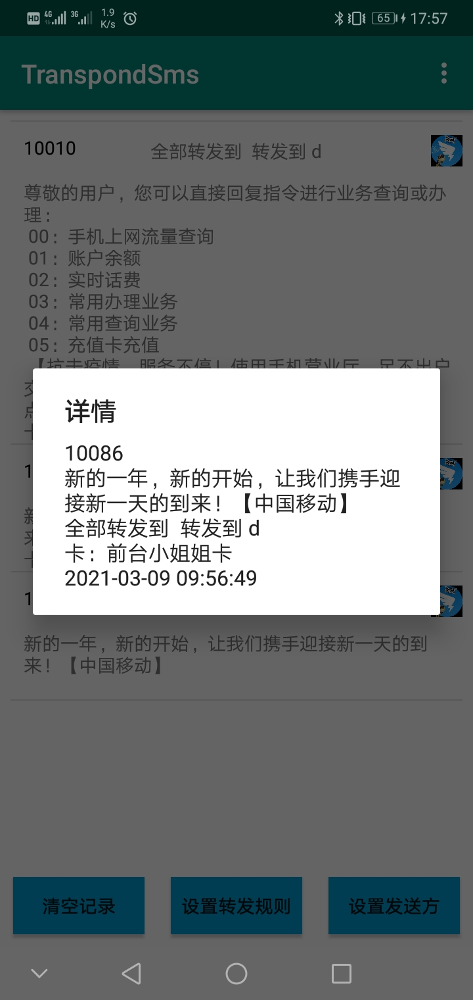
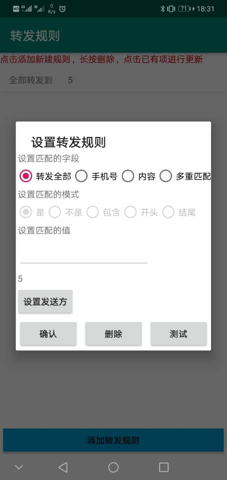
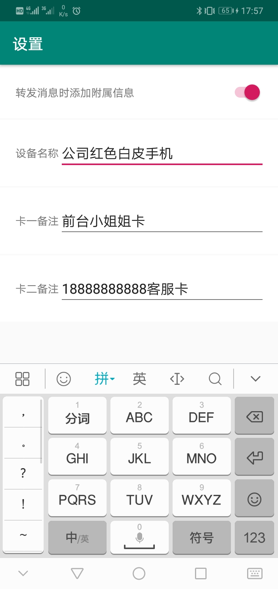

# 短信转发 信息转发 TranspondSms， 把Android手动的短信通过邮件或者pushplus转出去

--------
## 该工具实现特点和准则：
* **简单** 只做两件事：监听短信---》转发

由此带来的好处：
* 功能简单:（当时用Pad的时候，看手机验证码各种不方便，网上搜了好久也有解决方案）
> + AirDroid:手机管理工具功能太多，看着都耗电，权限太多，数据经过三方，账号分级
> + IFTTT:功能太多，看着耗电，权限太多，数据经过三方，收费
> + 还有些其他的也是这些毛病
* 省电：运行时只监听广播，有短信才执行转发，并记录最近n条的转发内容和转发状态
* 健壮：越简单越不会出错（UNIX设计哲学），就越少崩溃，运行越稳定持久
* 安全：依赖越简单，审查代码代价就越小，攻击面就越小

### 工作流程：
  

### 功能列表：
|  功能   | 描述  |
|  ----  | ----  |
| 转发监听  | 已实现 |
| 转发邮箱  | 单个邮箱已实现 |
| 转发pushplus  | 已实现 |
| 转发socket  | 已实现 |
| 转发规则  | （规则即：什么短信转发到哪里）已实现实现 |
| 多重规则  | 可通过“并且”，“或者”，“不是”组合多个转发规则 |
| 转发携带设备信息  | 转发的消息携带设备备注（自定义）和卡备注（可对卡槽自定义备注） |
| 兼容  |  已兼容6.xx、7.xx、8.xx、9.xx、10.xx （详细兼容机型和Android版本见[社区总结](http://tsms.allmything.com/topic/2)） |

### 使用流程：
1. 在Android手机上安装TSMS 本APP后点击应用图标打开
2. 在设置发送方页面，添加或点击已添加的发送方来设置转发短信使用的方式，现在支持钉钉机器人、邮箱、网页：
   + 配置邮箱请先在你邮箱的后台管理页面配置smtp选项，并设置密码（授权码），并参照说明配置TSMS弹出框的smtp信息。点击测试会使用该邮箱向配置的邮箱发送一条测试邮件；点击确认即可添加配置。
3. 在设置转发规则页面，添加或点击已添加的转发规则来设置转发什么样的短信，现在支持转发全部、根据手机号、根据短信内容：
   + 当设置转发全部时，所以接收到的短信都会用转发出去。
   + 当设置根据手机号或短信内容时，请设置匹配的模式和值，例如：”手机号 是 10086 发送方选钉钉“。
4. 点击主页面右上角的菜单可进入设置页面，在设置页面可以更新应用查看应用信息提交意见反馈等
5. 在主页面下拉可刷新转发的短信，点击清空记录可删除转发的记录

*注：该APP打开后会自动后台运行并在任务栏显示运行图标，请勿强杀，退出后请重新开启，并加入到系统白名单中，并允许后台运行*  

## LICENSE    
BSD
